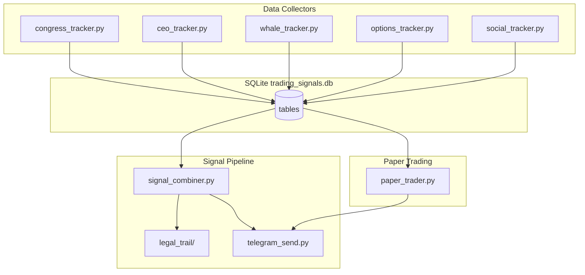

# sn9trader

Quantitative signal aggregator that tracks **legally public** trading footprints (Congress, CEO Form 4 filings, on-chain whales, options flow), combines them into confidence-weighted signals, paper-trades for validation, and sends Telegram alerts with auditable legal trails.

Spec sources: [`Context.md`](Context.md) (architecture & schema), [`Prompt.md`](Prompt.md) (build prompts 1–10).

---

## Changelog

| Date       | Change                                                                                                                   |
| ---------- | ------------------------------------------------------------------------------------------------------------------------ |
| 2026-06-05 | **Initial build** — All Prompt.md scripts (1–10) implemented, DB schema, cron, `run_all.sh`, venv setup. README created. |

> **Maintenance rule:** Update this changelog and relevant README sections after every major change (new tracker, schema migration, API swap, deployment change).

---

## What Was Built

Implementation follows [`Prompt.md`](Prompt.md) execution order. Each prompt maps to one primary script.

### PROMPT 1 — `init_db.py`

- Creates SQLite database `trading_signals.db` with full schema (see [Database Schema](#database-schema)).
- Creates project folders: `legal_trail/`, `logs/`, `paper_portfolio/`.
- Writes `.env.example` template (skipped if file already exists).
- Runs Etherscan API smoke test (block reward lookup for block `19000000`; falls back if v2 endpoint differs).
- Prints `Ready` on success.
- Constraints: functions only, no classes, under 150 lines.

### PROMPT 2 — `congress_tracker.py`

- Fetches congressional trades from House Stock Watcher API.
- **Fallback chain** (primary API is currently offline):
  1. `https://housestockwatcher.com/api/latest_trades`
  2. `https://house-stock-watcher-data.s3-us-west-2.amazonaws.com/data/all_transactions.json`
  3. [kadoa-org/congress-trading-monitor](https://github.com/kadoa-org/congress-trading-monitor) per-filer JSON on GitHub
- Filters to politicians: Pelosi, McConnell, Schiff, Lofgren, Sessions, Kelly, Tuberville.
- Filters tickers to S&P 500 (GitHub CSV primary, Wikipedia `lxml` fallback, 24h cache in `logs/sp500_tickers.txt`).
- Computes forward returns at `disclosure_date + 2 days` for 90d and 180d via `yfinance`.
- Rolling 6-month `win_rate` per politician.
- Logs to `logs/congress.log`. Cron: daily 02:00 IST.

### PROMPT 3 — `ceo_tracker.py` + `ciks.csv`

- Loads CEO list from `ciks.csv` (`name,cik,ticker`) — 50 entries for top S&P 500 CEOs.
- Scrapes SEC EDGAR Form 4 index per CIK (`browse-edgar?type=4`).
- Parses XML/HTML with BeautifulSoup for `transactionCode = P` (open-market purchases).
- Stores in `ceo_trades`, computes 12-month forward return and rolling win rate.
- Rate limit: `time.sleep(0.5)` between SEC requests. Cron: every 6 hours.

### PROMPT 4 — `whale_tracker.py`

- Loads wallet addresses from `WHALE_WALLETS` (comma-separated) or `WHALE_WALLETS_CSV` file path.
- Polls Etherscan `tokentx` per wallet (last 100 txs).
- USD value via CoinGecko token price API; keeps txs > $100k.
- Direction detection vs exchange prefixes (Binance hot wallet, Coinbase, Kraken, OKX, etc.).
- `exchange_to_wallet` → accumulation → `alert_flag = 1`.
- Dedup via `whale_state` table (`last_ts_{wallet}`). Cron: every 5 minutes.

### PROMPT 5 — `options_tracker.py`

- **NSE:** session cookie from homepage, then `option-chain-indices?symbol=NIFTY`.
- Compares OI vs `options_oi_snapshot`; flags >30% change as unusual.
- **US:** Barchart unusual-options placeholder scrape (JS-rendered site — limited without browser).
- Stores `options_flow` with `sentiment` (bullish/bearish). Cron: every 15 minutes.

### PROMPT 6 — `signal_combiner.py`

- Reads all sources from last 24h (DB queries).
- Per-ticker scores:
  - `congress_score` = avg win_rate × multiplier
  - `ceo_score` = avg win_rate × 2.0 if multiple insiders
  - `whale_score` = 0.7 accumulation / 0.3 distribution / 0
  - `options_score` = 0.8 call spike / 0.2 put spike / 0
- Applies confidence formula from `Context.md` (weights 0.35 / 0.30 / 0.20 / 0.15, multi-source bonus).
- Social penalty: −10 confidence if strong negative social sentiment (from `social_accuracy`).
- If confidence > 70: inserts `signals` row, writes `legal_trail/{ticker}_{timestamp}.json`, calls `telegram_send.send_signal_sync()`.
- Cron: every 6 hours (00:00, 06:00, 12:00, 18:00 IST).

### PROMPT 7 — `telegram_send.py`

- Loads `TELEGRAM_BOT_TOKEN` or `TELEGRAM_TOKEN` from `.env`.
- `send_signal_sync(signal_dict)` — callable from combiner/paper trader.
- HTML message format per `Context.md`; inline keyboard "Legal Trail" button; attaches JSON file.
- Subscriber table `subscribers`; `/start` auto-subscribes, `/status` placeholder, `/help`.
- Daemon mode: `python telegram_send.py` (python-telegram-bot v20 polling).

### PROMPT 8 — `paper_trader.py`

- Opens positions for signals where `paper_status IS NULL` ($10k fixed, 0.1% buy slippage).
- Closes when `suggested_hold` days elapsed (0.1% sell slippage), records P&L.
- Weekly Monday report: total return, Sharpe (risk-free 5%), max drawdown, vs SPY.
- Sends report via Telegram. Cron: daily 22:00 IST.

### PROMPT 9 — `setup_cron.py`

- Generates `sn9trader.cron` with absolute paths to venv Python.
- Creates executable `run_all.sh` (runs all trackers once for testing).
- Marks all `.py` scripts executable.
- Attempts `crontab` install with `# sn9trader` marker.

### PROMPT 10 — `social_tracker.py` (optional)

- READ-ONLY tweepy v2 monitor; no auto-post.
- Logs `$TICKER` mentions from `TWITTER_USER_IDS` into `social_accuracy`.
- Scores accuracy after 7 days via `yfinance`.
- Used only as secondary filter in `signal_combiner.py` (never sole trade trigger).

---

## Architecture



---

## Project Structure

```
sn9trader/
├── init_db.py              # DB + folders + Etherscan test
├── congress_tracker.py     # Congressional trades
├── ceo_tracker.py          # SEC Form 4 insider buys
├── whale_tracker.py        # Etherscan whale txs
├── options_tracker.py      # NSE + US options flow
├── signal_combiner.py      # Multi-source confidence signals
├── telegram_send.py        # Telegram bot + send_signal_sync()
├── paper_trader.py         # Paper portfolio simulation
├── setup_cron.py           # Cron + run_all.sh generator
├── social_tracker.py       # Optional X/Twitter accuracy (PROMPT 10)
├── ciks.csv                # CEO name, CIK, ticker mapping
├── requirements.txt        # Python dependencies
├── run_all.sh              # One-shot test runner
├── sn9trader.cron          # Generated crontab entries
├── Context.md              # Project spec
├── Prompt.md               # Build prompts
├── .env.example            # Env template
├── .env                    # Secrets (gitignored)
├── legal_trail/            # JSON audit files per signal
├── logs/                   # Per-tracker log files
├── paper_portfolio/        # Reserved for portfolio artifacts
└── trading_signals.db      # SQLite database (gitignored)
```

---

## Database Schema

| Table                 | Purpose                                                |
| --------------------- | ------------------------------------------------------ |
| `congress_trades`     | Politician trades + forward_return_90d/180d + win_rate |
| `ceo_trades`          | Form 4 purchases + forward_return_12m + win_rate       |
| `whale_tx`            | On-chain transfers >$100k + direction + alert_flag     |
| `whale_state`         | Per-wallet last timestamp for dedup                    |
| `options_flow`        | Unusual OI activity + sentiment                        |
| `options_oi_snapshot` | Previous OI poll for delta detection                   |
| `signals`             | Combined signals + legal_trail_path + paper_status     |
| `paper_portfolio`     | Simulated entries/exits and P&L                        |
| `subscribers`         | Telegram chat_ids                                      |
| `social_accuracy`     | Tweet ticker mentions + 7d accuracy score              |

---

## Setup

### 1. Python environment

macOS requires a venv (PEP 668):

```bash
cd sn9trader
python3 -m venv venv
source venv/bin/activate
pip install -r requirements.txt
```

### 2. Environment variables

Copy and fill `.env`:

```bash
cp .env.example .env
```

| Variable                                | Used by                 | Notes                       |
| --------------------------------------- | ----------------------- | --------------------------- |
| `ETHERSCAN_API_KEY` / `ETHERSCAN_KEY`   | init_db, whale_tracker  | Etherscan free tier         |
| `TELEGRAM_BOT_TOKEN` / `TELEGRAM_TOKEN` | telegram_send, combiner | From @BotFather             |
| `WHALE_WALLETS`                         | whale_tracker           | Comma-separated addresses   |
| `WHALE_WALLETS_CSV`                     | whale_tracker           | Optional file path override |
| `TWITTER_BEARER_TOKEN`                  | social_tracker          | X API v2 bearer             |
| `TWITTER_USER_IDS`                      | social_tracker          | Comma-separated user IDs    |
| `THETADATA_USER` / `THETADATA_PASS`     | options_tracker         | Reserved for ThetaData tier |

### 3. Initialize database

```bash
python init_db.py
# Expected output: Ready
```

### 4. Run all trackers (test)

```bash
./run_all.sh
```

### 5. Start Telegram bot (separate terminal)

```bash
python telegram_send.py
```

Message your bot `/start` to subscribe.

### 6. Install cron (production VM)

```bash
python setup_cron.py
# or manually: crontab sn9trader.cron
```

Target deployment per `Context.md`: Debian VM at `/sn9trader` via SSH.

---

## Cron Schedule

| Schedule       | Script              | Log               |
| -------------- | ------------------- | ----------------- |
| `0 2 * * *`    | congress_tracker.py | logs/congress.log |
| `0 */6 * * *`  | ceo_tracker.py      | logs/ceo.log      |
| `*/5 * * * *`  | whale_tracker.py    | logs/whale.log    |
| `*/15 * * * *` | options_tracker.py  | logs/options.log  |
| `0 */6 * * *`  | signal_combiner.py  | logs/signals.log  |
| `0 22 * * *`   | paper_trader.py     | logs/paper.log    |

---

## Signal Confidence Formula

From `Context.md`:

```python
base_confidence = (
    congress_score * 0.35 +
    ceo_score      * 0.30 +
    whale_score    * 0.20 +
    options_score  * 0.15
)
# Multi-source bonus: *= (1 + (num_sources - 1) * 0.15)
# Threshold: >70 = trade signal, >85 = strong signal
```

---

## Validation Gate (Before Real Money)

Per `Prompt.md` — do **not** deploy real capital until:

- 90 days paper trading completed
- Paper portfolio outperforms SPY by >10%
- At least 20 signals generated, win rate >55%
- No technical bugs for 30 consecutive days

---

## Known Issues & Limitations

| Issue                                                | Status        | Workaround                                                |
| ---------------------------------------------------- | ------------- | --------------------------------------------------------- |
| `housestockwatcher.com` DNS dead                     | Confirmed     | Kadao GitHub fallback in `congress_tracker.py`            |
| S3 mirror returns 403                                | Confirmed     | Kadao fallback                                            |
| `congress_tracker` first run slow                    | Expected      | 2s sleep per yfinance call; hundreds of historical trades |
| Barchart US options is JS-rendered                   | Limited       | Placeholder row only; needs ThetaData or headless browser |
| `WHALE_WALLETS` empty in `.env`                      | Config needed | Add 50 wallet addresses before whale tracker works        |
| No Telegram subscribers until `/start`               | By design     | Run bot daemon, send `/start`                             |
| `ciks.csv` has duplicate/wrong CIKs for some rows    | Review needed | User should validate CIK mappings                         |
| `.env.example` stale if created before schema update | Minor         | Delete and re-run `init_db.py` to regenerate              |

---

## Manual Verification Queries

```bash
sqlite3 trading_signals.db "SELECT COUNT(*) FROM congress_trades;"
sqlite3 trading_signals.db "SELECT COUNT(*) FROM ceo_trades;"
sqlite3 trading_signals.db "SELECT COUNT(*) FROM whale_tx;"
sqlite3 trading_signals.db "SELECT COUNT(*) FROM options_flow;"
sqlite3 trading_signals.db "SELECT ticker, confidence, created_at FROM signals ORDER BY id DESC LIMIT 5;"
sqlite3 trading_signals.db "SELECT * FROM paper_portfolio LIMIT 5;"
```

Re-run `./run_all.sh` — duplicate rows should not increase (UNIQUE constraints on trade tables).

---

## Dependencies

```
python-dotenv
requests
yfinance
pandas
beautifulsoup4
lxml
numpy
python-telegram-bot==20.7
tweepy
```

---

## License & Compliance

All data sources are legally public (STOCK Act disclosures, SEC EDGAR, on-chain public ledgers, exchange-published option chains). Every signal above threshold generates a JSON legal trail in `legal_trail/`. Social tracker is read-only; never auto-trades on social signals alone.

# sn9trader
